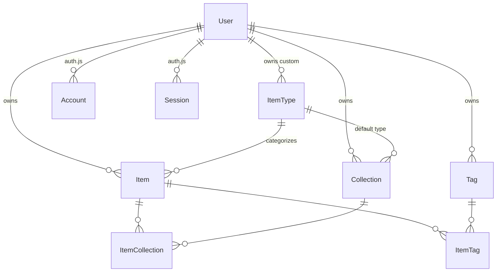
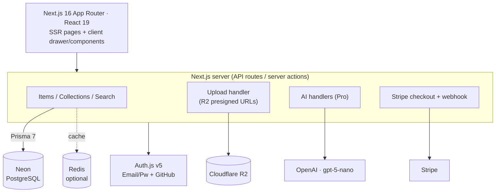

# 📦 DevStash — Product & Technical Spec

> One fast, searchable, AI-enhanced hub for all of a developer's knowledge and resources.

*This is a working spec — clarified and structured from the original notes. Nothing here is locked; the "Open decisions" callouts flag the few places I made a judgement call so you can confirm or override.*

---

## 1. Problem

Developers keep their essentials scattered across too many places:

- Code snippets in VS Code or Notion
- AI prompts buried in chat histories
- Context files lost inside projects
- Useful links in browser bookmarks
- Docs in random folders
- Commands in `.txt` files or shell history
- Project templates in GitHub gists

The result is constant context switching, lost knowledge, and inconsistent workflows. **DevStash** consolidates all of it into a single hub that is quick to search, quick to add to, and enhanced with AI.

---

## 2. Target Users

| Persona | What they need from DevStash |
|---|---|
| 👨‍💻 **Everyday Developer** | Fast grab-and-go for snippets, prompts, commands, links |
| 🤖 **AI-first Developer** | A home for prompts, contexts, workflows, system messages |
| 🎓 **Content Creator / Educator** | Storage for code blocks, explanations, course notes |
| 🏗️ **Full-stack Builder** | A library of patterns, boilerplates, API examples |

---

## 3. Core Concepts

### 3.1 Items & Item Types

An **item** is the atomic unit. Every item has a **type**. Users can eventually create custom types (Pro), but the app ships with these **system types** (immutable):

| Type | Icon (lucide) | Color | Storage kind | Plan |
|---|---|---|---|---|
| Snippet | `Code` | `#3b82f6` (blue) | text | Free |
| Prompt | `Sparkles` | `#8b5cf6` (purple) | text | Free |
| Note | `StickyNote` | `#fde047` (yellow) | text | Free |
| Command | `Terminal` | `#f97316` (orange) | text | Free |
| Link | `Link` | `#10b981` (emerald) | url | Free |
| File | `File` | `#6b7280` (gray) | file | **Pro** |
| Image | `Image` | `#ec4899` (pink) | file | **Pro** |

**Storage kinds** collapse to three:

- `TEXT` — snippet, prompt, note, command (stored in `content`, editable via markdown)
- `URL` — link (stored in `url`)
- `FILE` — file, image (stored in Cloudflare R2, referenced by `fileUrl`)

Items are created and opened in a **quick-access drawer** — never a full page load.

Type-scoped listing routes look like `/items/snippets`, `/items/prompts`, etc.

> **🔎 Open decision:** the original `ITEM.contentType` was `text | file`, but links need a third state. I modeled it as an enum `ContentType { TEXT, URL, FILE }` so a link isn't mistaken for a text item. Confirm this is the split you want.

### 3.2 Collections

A **collection** groups items of any type. An item can live in **multiple** collections (e.g. a React snippet in both *React Patterns* and *Interview Prep*) — this is a many-to-many via a join table.

Examples: *React Patterns* (snippets, notes) · *Context Files* (files) · *Python Snippets* (snippets).

### 3.3 Tags

Lightweight labels for cross-cutting search. Tags are **scoped per user** and reused across their items (many-to-many).

> **🔎 Open decision:** the original `TAG` had only `id` + `name`. I scoped tags to the user and made `(userId, name)` unique so two users can both have a `react` tag without collision, and one user can't create duplicates.

---

## 4. Features

**A. Items** — typed, quick create/access via drawer, markdown editor for text types, syntax highlighting, optional `language` for code.

**B. Collections** — any item type; add/remove items to/from multiple collections; view which collections an item belongs to.

**C. Search** — across content, tags, titles, and types.

**D. Auth** — email/password **or** GitHub sign-in.

**E. Quality-of-life**
- Favorite items *and* collections
- Pin items to top
- Recently used
- Import code from a file
- File upload for `file` / `image` types
- Export data in multiple formats
- Dark mode (default) / light mode
- Micro-interactions throughout

**F. AI (Pro only)** — auto-tag suggestions · summaries · "explain this code" · prompt optimizer.

---

## 5. Data Model (Prisma)

> **⚠️ Migrations only.** Never `prisma db push` or hand-edit the database. All schema changes go through `prisma migrate dev` locally → committed migration → `prisma migrate deploy` in prod.

### 5.1 Entity relationships



### 5.2 Schema

```prisma
// prisma/schema.prisma
// Prisma 7 ships the Rust-free client via the new `prisma-client` generator,
// which requires an explicit output path. Verify against the Prisma 7 docs.
generator client {
  provider = "prisma-client"
  output   = "../src/generated/prisma"
}

datasource db {
  provider  = "postgresql"
  url       = env("DATABASE_URL")   // Neon pooled connection
  directUrl = env("DIRECT_URL")     // Neon direct connection, used for migrations
}

enum ContentType {
  TEXT
  URL
  FILE
}

// ─────────────────────────────  App models  ─────────────────────────────

model Item {
  id          String      @id @default(cuid())
  title       String
  contentType ContentType @default(TEXT)
  content     String?     // text body (snippet/note/prompt/command); null for url/file
  url         String?     // for link items
  fileUrl     String?     // R2 object URL; null unless FILE
  fileName    String?     // original filename
  fileSize    Int?        // bytes
  description String?
  language    String?     // optional, drives syntax highlighting
  isFavorite  Boolean     @default(false)
  isPinned    Boolean     @default(false)
  lastUsedAt  DateTime?   // powers "recently used"
  createdAt   DateTime    @default(now())
  updatedAt   DateTime    @updatedAt

  userId      String
  user        User        @relation(fields: [userId], references: [id], onDelete: Cascade)
  itemTypeId  String
  itemType    ItemType    @relation(fields: [itemTypeId], references: [id])

  collections ItemCollection[]
  tags        ItemTag[]

  @@index([userId])
  @@index([userId, itemTypeId])
}

model ItemType {
  id          String   @id @default(cuid())
  name        String   // "snippet", "prompt", ...
  icon        String   // lucide icon name, e.g. "Code"
  color       String   // hex, e.g. "#3b82f6"
  isSystem    Boolean  @default(false)

  userId      String?  // null for system types
  user        User?    @relation(fields: [userId], references: [id], onDelete: Cascade)

  items       Item[]
  collections Collection[] // back-reference for Collection.defaultType

  @@unique([userId, name])
}

model Collection {
  id            String    @id @default(cuid())
  name          String    // "React Hooks", "Prototype Prompts", ...
  description   String?
  isFavorite    Boolean   @default(false)

  defaultTypeId String?   // default type for new items in an empty collection
  defaultType   ItemType? @relation(fields: [defaultTypeId], references: [id])

  userId        String
  user          User      @relation(fields: [userId], references: [id], onDelete: Cascade)

  items         ItemCollection[]

  createdAt     DateTime  @default(now())
  updatedAt     DateTime  @updatedAt

  @@index([userId])
}

model ItemCollection {
  itemId       String
  collectionId String
  addedAt      DateTime   @default(now()) // tracks when the item was added

  item         Item       @relation(fields: [itemId], references: [id], onDelete: Cascade)
  collection   Collection @relation(fields: [collectionId], references: [id], onDelete: Cascade)

  @@id([itemId, collectionId])
  @@index([collectionId])
}

model Tag {
  id     String    @id @default(cuid())
  name   String
  userId String
  user   User      @relation(fields: [userId], references: [id], onDelete: Cascade)
  items  ItemTag[]

  @@unique([userId, name])
}

model ItemTag {
  itemId String
  tagId  String
  item   Item @relation(fields: [itemId], references: [id], onDelete: Cascade)
  tag    Tag  @relation(fields: [tagId], references: [id], onDelete: Cascade)

  @@id([itemId, tagId])
  @@index([tagId])
}

// ─────────────────────  Auth.js (NextAuth v5) + billing  ─────────────────────

model User {
  id                   String    @id @default(cuid())
  name                 String?
  email                String    @unique
  emailVerified        DateTime?
  image                String?
  passwordHash         String?   // for email/password credentials

  // Billing
  isPro                Boolean   @default(false)
  stripeCustomerId     String?   @unique
  stripeSubscriptionId String?   @unique

  // App data
  items       Item[]
  itemTypes   ItemType[]
  collections Collection[]
  tags        Tag[]

  // Auth.js
  accounts    Account[]
  sessions    Session[]

  createdAt   DateTime  @default(now())
  updatedAt   DateTime  @updatedAt
}

model Account {
  id                String  @id @default(cuid())
  userId            String
  type              String
  provider          String
  providerAccountId String
  refresh_token     String?
  access_token      String?
  expires_at        Int?
  token_type        String?
  scope             String?
  id_token          String?
  session_state     String?
  user              User    @relation(fields: [userId], references: [id], onDelete: Cascade)

  @@unique([provider, providerAccountId])
}

model Session {
  id           String   @id @default(cuid())
  sessionToken String   @unique
  userId       String
  expires      DateTime
  user         User     @relation(fields: [userId], references: [id], onDelete: Cascade)
}

model VerificationToken {
  identifier String
  token      String
  expires    DateTime

  @@unique([identifier, token])
}
```

---

## 6. Architecture



**Principles**
- One codebase / one repo — less overhead.
- SSR pages with dynamic client components; API routes / server actions for backend needs (items, uploads, AI calls).
- TypeScript everywhere for type safety.

---

## 7. Tech Stack

| Layer | Choice | Notes |
|---|---|---|
| Framework | **Next.js 16 / React 19** | App Router, Turbopack is now the default bundler; middleware is replaced by `proxy.ts`; route `params` are async. |
| Language | **TypeScript** | |
| Database | **Neon** (serverless PostgreSQL) | Use pooled `DATABASE_URL` + direct `DIRECT_URL` for migrations. |
| ORM | **Prisma 7** | Rust-free client, new `prisma-client` generator, config now lives in `prisma.config.ts`. |
| Cache | **Redis** *(maybe)* | For hot reads / recently-used. Optional for MVP. |
| File storage | **Cloudflare R2** | Presigned uploads; store URL + metadata on the item. |
| Auth | **Auth.js (NextAuth v5)** | Email/password + GitHub OAuth. |
| AI | **OpenAI `gpt-5-nano`** | Cheap + fast; good for tagging/summaries. A newer `gpt-5.4-nano` also exists if you want more headroom. |
| Styling | **Tailwind CSS v4 + shadcn/ui** | |
| Icons | **lucide-react** | Icon names stored on `ItemType.icon`. |

### `prisma.config.ts` (Prisma 7)

```ts
import 'dotenv/config'
import { defineConfig, env } from 'prisma/config'

export default defineConfig({
  schema: 'prisma/schema.prisma',
  migrations: { seed: 'tsx prisma/seed.ts' },
  datasource: { url: env('DATABASE_URL') },
})
```

### Environment variables

```bash
# Database (Neon)
DATABASE_URL=            # pooled
DIRECT_URL=              # direct (migrations)

# Auth.js
AUTH_SECRET=
AUTH_GITHUB_ID=
AUTH_GITHUB_SECRET=

# Cloudflare R2
R2_ACCOUNT_ID=
R2_ACCESS_KEY_ID=
R2_SECRET_ACCESS_KEY=
R2_BUCKET=
R2_PUBLIC_URL=

# OpenAI
OPENAI_API_KEY=

# Stripe
STRIPE_SECRET_KEY=
STRIPE_WEBHOOK_SECRET=
NEXT_PUBLIC_STRIPE_PUBLISHABLE_KEY=
STRIPE_PRICE_MONTHLY=
STRIPE_PRICE_YEARLY=
```

---

## 8. Suggested Routes

| Route | Purpose |
|---|---|
| `/` | Dashboard — grid of color-coded collection cards |
| `/items` | All items |
| `/items/[type]` | Type-scoped list (`/items/snippets`, …) |
| `/collections/[id]` | Single collection |
| `/search` | Search results |
| `/settings` · `/settings/billing` | Account & plan |
| `/login` | Auth |
| `/api/auth/[...nextauth]` | Auth.js |
| `/api/items` · `/api/collections` | CRUD |
| `/api/upload` | R2 presigned upload |
| `/api/ai/*` | Tag / summarize / explain / optimize (Pro) |
| `/api/stripe/webhook` | Subscription sync |
| `/api/export` | Data export |

---

## 9. Monetization (Freemium)

| | Free | Pro — **$8/mo** or **$72/yr** |
|---|---|---|
| Items | 50 total | Unlimited |
| Collections | 3 | Unlimited |
| System types | All except file/image | All |
| File & image uploads | ❌ | ✅ |
| Custom types | ❌ | ✅ *(later)* |
| Search | Basic | Basic |
| AI features | ❌ | ✅ auto-tag · summaries · explain · prompt optimizer |
| Export (JSON/ZIP) | ❌ | ✅ |
| Support | Standard | Priority |

> **Build note:** wire the plan-gating foundation now (a single `canUse(feature, user)` check + `isPro` flag), but during development **let all users access everything**. Flip the gates on before launch.

---

## 10. UI / UX

**General** — modern, minimal, developer-focused. Dark mode by default, light optional. Clean typography, generous whitespace, subtle borders/shadows, syntax highlighting for code blocks. References: **Notion, Linear, Raycast**.

**Layout**
- Collapsible **sidebar** + main content.
- Sidebar: item types (linking to `/items/[type]`) + latest collections.
- Main: grid of **collection cards**, background color-coded by the item type they hold most of. Items render beneath as cards with a **border color** matching their type.
- Items open in a **quick-access drawer**.

**Responsive** — desktop-first but mobile-usable; sidebar collapses to a drawer on mobile.

**Micro-interactions** — smooth transitions, card hover states, toast notifications for actions, loading skeletons.

---

## 11. Suggested Build Order

1. **Foundation** — Auth.js (email + GitHub), schema + first migration, layout/sidebar, dark mode, seed system `ItemType`s.
2. **Items** — CRUD, type drawer, markdown editor, syntax highlighting.
3. **Collections** — many-to-many management, favorites, pin, recently-used.
4. **Search** — content/tags/titles/types.
5. **Files** — R2 presigned uploads + import-from-file.
6. **AI (Pro)** — tagging, summaries, explain, prompt optimizer.
7. **Billing** — Stripe checkout + webhook, plan gating, export.
8. **Polish** — toasts, skeletons, micro-interactions, mobile drawer.

---

## 12. Reference Docs

- Next.js 16 — https://nextjs.org/docs · [v16 upgrade guide](https://nextjs.org/docs/app/guides/upgrading/version-16)
- Prisma 7 — https://www.prisma.io/docs · [changelog](https://www.prisma.io/changelog) · [v7 announcement](https://www.prisma.io/blog/announcing-prisma-orm-7-0-0)
- Neon — https://neon.tech/docs
- Auth.js (NextAuth v5) — https://authjs.dev
- Cloudflare R2 — https://developers.cloudflare.com/r2
- Tailwind CSS v4 — https://tailwindcss.com/docs
- shadcn/ui — https://ui.shadcn.com
- lucide icons — https://lucide.dev/icons
- OpenAI `gpt-5-nano` — https://developers.openai.com/api/docs/models/gpt-5-nano · [pricing](https://developers.openai.com/api/docs/pricing)
- Stripe — https://stripe.com/docs
